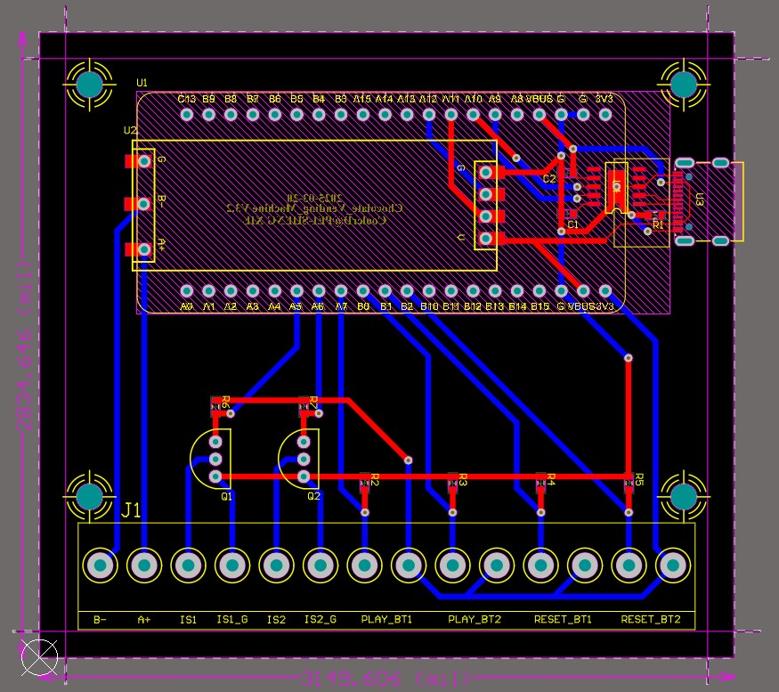
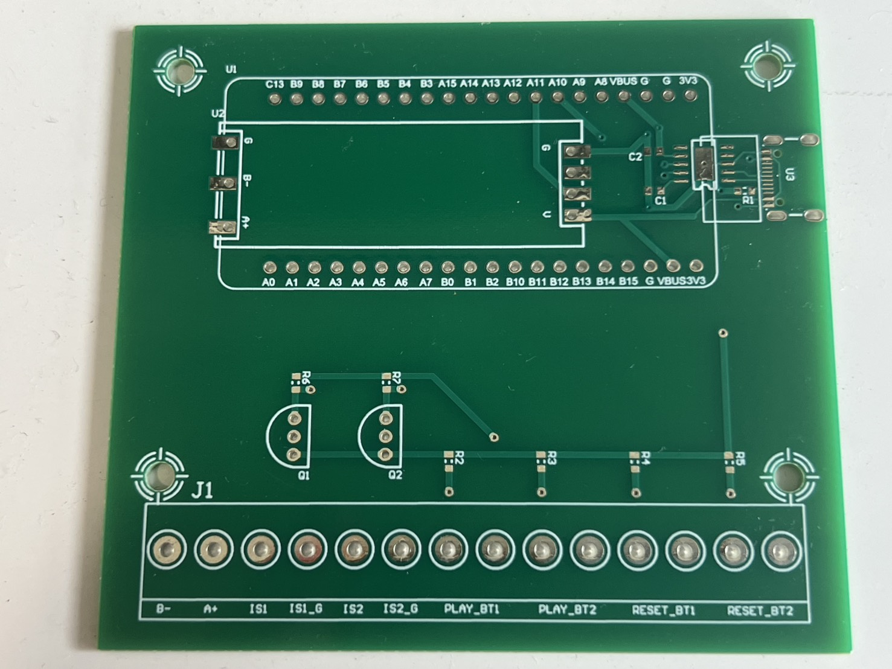
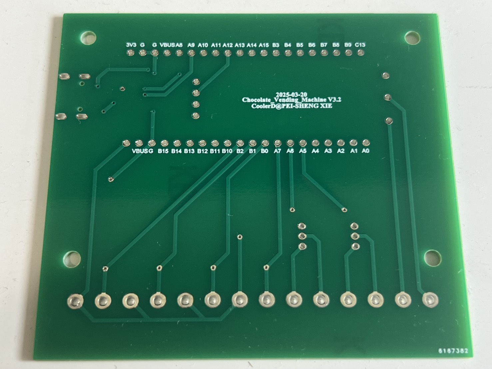

# Chocolate Vending Machine
Version History

## 📖專案介紹

本專案為巧克力販賣機控制板，
採用 STM32F411 開發版控制周邊模組。

設計工具：
- Altium Designer 21

## 🏷️版本資訊

| 項目 | 內容 |
|--------|--------|
| Current Version | V3.2 |
| Last Update | 2025/03/20 |
| Status | Finsh |

## 📝版本變更紀錄

<b> V1.0 (2024/12/19) </b>

#### 新增內容

- 初版原理圖
- CH340K USB 轉 UART
- Type-C 輸入
- 紅外線感測器
- UART 轉 RS485
- 測試腳位
- 備用開關

#### 問題

- 感測器輸入數量不夠
- 開關輸入數量不夠

<b> V2.0 (2025/01/06) </b>

#### 修改原因

與團隊討論發現開關、感測器輸入的數量不足，新增3組當備用。
發現測試腳位和備用開關用不到，所以將功能移除。

#### 修改內容

- 原理圖修改
- 移除測試腳位、備用開關
- 增加3組感測器輸入、3組開關輸入數量

#### 後續規劃

- 與硬體機構進行測試

<b> V2.1 (2025/01/14) </b>

#### 修改內容

- Layout 優化

#### 問題

- 感測器輸入數量過多

<b> V2.2 (2025/01/17) </b>

#### 修改原因

與團隊討論後將感測器輸入功能移除，保留2組預防未來需要使用。

#### 修改內容

- Layout 優化
- 減少2組感測器輸入

<b> V3.0 (2025/02/24) </b>

#### 修改原因

原本 Terminal_Block 是分開的，因為美觀和焊接方便改成相連的，
重新 Layout 優化，方便檢視。

#### 修改內容

- Layout 優化
- 更換 Terminal_Block 封裝

#### 後續規劃

- 與設計好的防護外殼進行結合

<b> V3.1 (2025/03/20) </b>

#### 修改原因

為了固定防護外殼，新增4個孔洞。

#### 修改內容

- Layout 優化
- 增加4個外殼固定孔

#### 後續規劃

- 最後修改與確認，進行打樣測試

<b> V3.2 (2025/03/20) </b>

#### 修改原因

最終正式版，將Layout優化成送洗的版本。

#### 修改內容

- Layout 優化
- 增加作品屬名

## 📷成品照片

    
    PCB Layout

    
    Product Front Side

    
    Product Back Side

