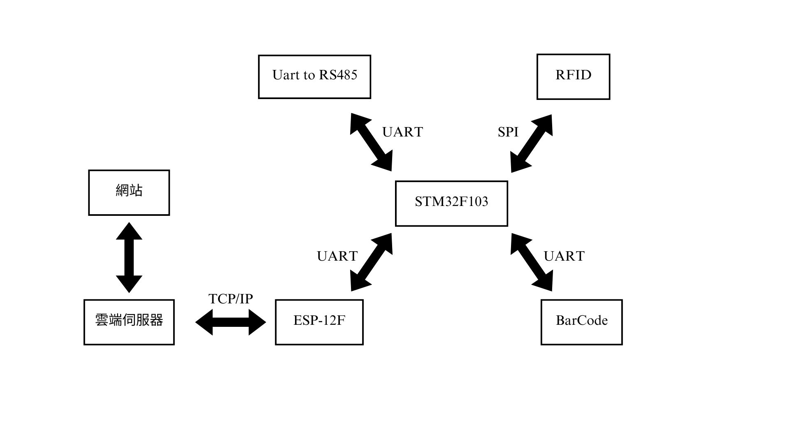
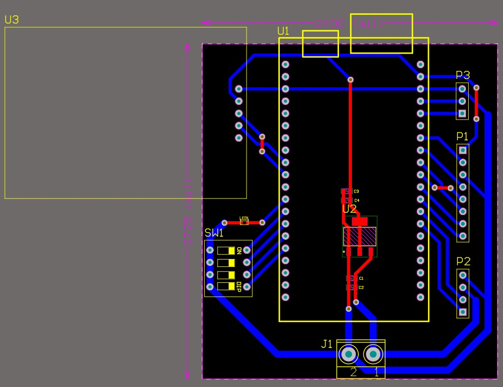
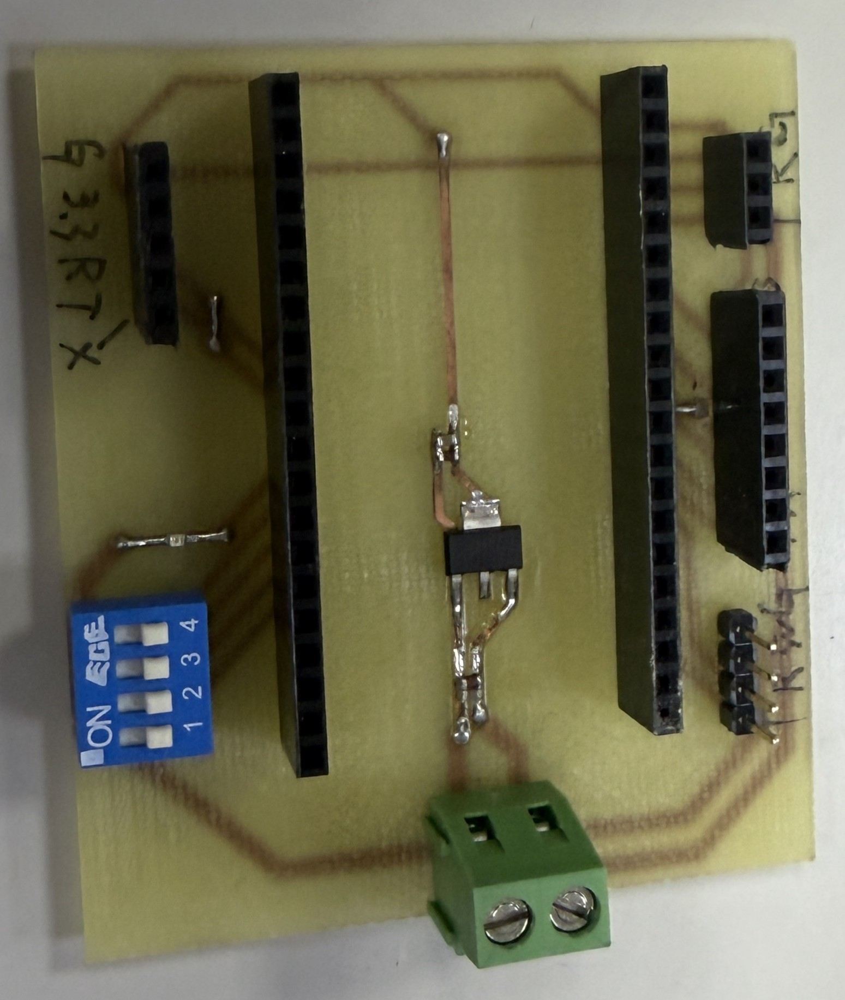

# Vending Machine

## 📖專案介紹

本專案為販賣機控制板。使用 Wi-Fi 模組接收來自網站的訊息，
接者透過 STM32F103 開發版和 RFID 模組進行資料的比對，
之後開發板送出訊號讓商品掉落，最後拿商品掃描 BarCode 模組做最後確認。

設計工具：
- Altium Designer 21

## 🔧系統架構

    
     
     Figure 1. Hardware Architecture Diagram 

## 🏷️版本資訊

| 項目            | 內容        |
| --------------- | ---------- |
| Current Version | V1.1       |
| Last Update     | 2024/10/07 |
| Status          | Finsh      |

## 📷成品照片

    
     
     Figure 2. PCB Layout 

    
     
     Figure 3. Product Front Side 

## 📝版本變更紀錄

<b> V1.0 (2024/9/11) </b>

#### 新增內容

- 初版原理圖
- RFID
- BarCode
- ESP-12F
- 馬達輸出10組

#### 問題

- 馬達驅動方式修改
- 需要一組 LED 判斷程式是否運行

<b> V1.1 (2024/10/07) </b>

#### 修改原因

與團隊討論發現修改馬達驅動的方式，將 GPIO 修改成 UART，
並增加LED燈來檢視程式是否有在運作。

#### 修改內容

- 原理圖修改
- Layout 優化
- 新增 LED 一組、UART 輸出一組

